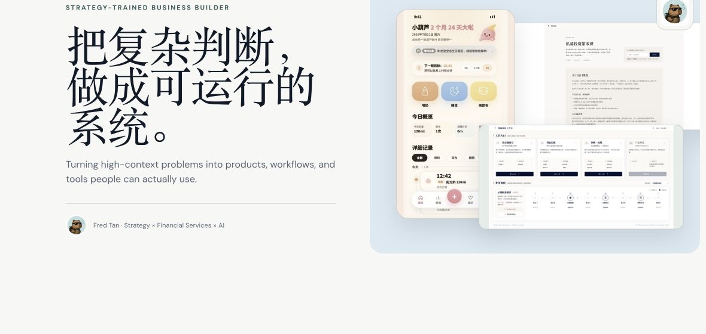
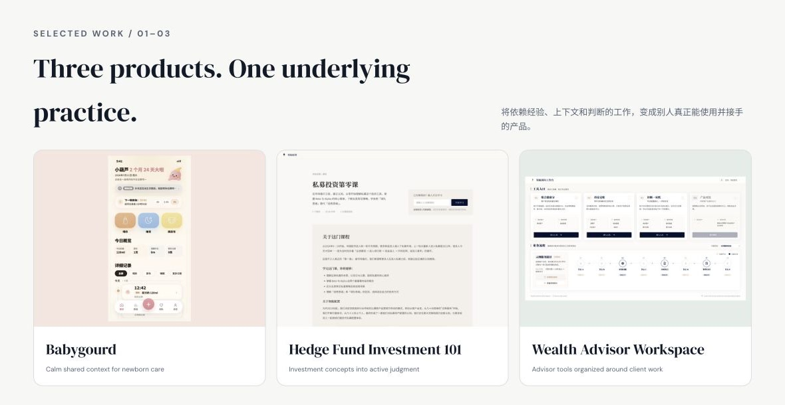

A strategy-trained business builder working across financial services, AI products, and agent workflows.

擅长把复杂、非标准、依赖专家判断的问题，转化为人与 AI 可以共同使用的产品、工作流与工具。

## Selected work

### 01 · Babygourd / 宝葫芦

A calm shared-care product for newborn families — designed to lower recording burden and give parents and caregivers one continuous picture of what has happened.

`Shared family timeline` · `Fast recording` · `Mobile web` · `Deployed`

[Explore a sample day](https://baohulu.love/?mode=demo) · [View project](https://github.com/diver-FT/babygourd-showcase)

### 02 · Hedge Fund Investment 101 / 私募投资第零课

An interactive learning product that turns repeatedly explained investment knowledge into a structured journey from first principles to strategy judgment and portfolio thinking.

`5 modules` · `19 lessons` · `~80 minutes` · `Judgment tasks and strategy builder`

[View project](https://github.com/diver-FT/linghang-course-zero-showcase)

### 03 · Wealth Advisor Workspace

An operating surface connecting portfolio review, the Linghang Portfolio Tracker, diagnostic briefs, and product comparison around the advisor’s real work.

`Advisor tools · service paths · human handoffs` · `Investor + advisor portfolio flows`

[View project](https://github.com/diver-FT/linghang-advisor-workbench-showcase) · [Explore the Portfolio Tracker demo](https://lh-northstar.com/)

<!-- open-source-skills -->

## The practice behind the projects

The recurring pattern across this work is **judgment into systems**:

1. **Start with the real job** — understand the messy workflow before designing the interface or adding an agent.
2. **Make judgment explicit** — identify the inputs, decisions, exceptions, and artifacts experts carry implicitly.
3. **Build to learn** — use working products to discover what a specification could not predict.
4. **Preserve human agency** — keep consequential actions visible, reviewable, and owned by a person.

AI lowers the cost of execution. The harder advantage is defining what should be executed, what context matters, and where a human must still decide.

## Background

- Built and scaled a wealth-management advisory system spanning customer diagnosis, RM workflow, content, tools, and delivery.
- Earlier experience in strategy consulting, research, and executive problem solving.
- Now focused on AI Product, Agent Workflow, and AI-native operator-builder roles.

**Dive. Think. Build.**
